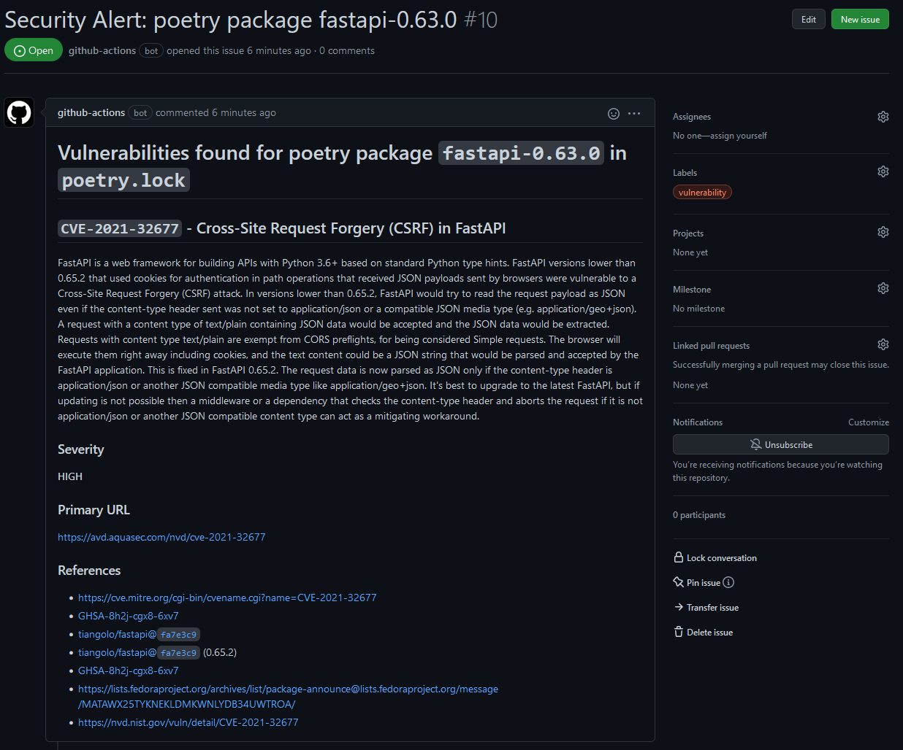

# GitHub Action - Trivy Issue Reporter

> [GitHub Action](https://github.com/features/actions) for [Trivy](https://github.com/aquasecurity/trivy) Issue Reporting


[](https://github.com/Chili-Piper/trivy-report-issue-action/actions/workflows/trivy-sca.yml)
[](https://github.com/Chili-Piper/trivy-report-issue-action/actions/workflows/codeql.yml)

This action was forked from CemitDigital. Error handling and additional functionality was added.

This GitHub action reports results from a [Trivy](https://github.com/aquasecurity/trivy) vulnerability scan as GitHub issues.
It will parse the *JSON* file and look for any findings (vulnerabilities and secrets), and report them as issues (unless they are already reported).
Issues may also be assigned to specific users, and can be attached to a GitHub project.

If a package has multiple vulnerabilities it will be grouped on the package and only one issue is created.

## Table of Contents

- [Usage](#usage)
  - [Workflow](#workflow)  
- [Inputs](#inputs)
- [Building and Testing](#building-and-testing)
- [Development](#development)

## Examples



## Usage

This action requires a file containing the scan result from Trivy. First run the
[Trivy scan action](https://github.com/aquasecurity/trivy-action) and tell it to output
in `JSON` format and into a file, then use that file as input to this action.

### Issue label

First make sure the repository has the required issue label, this is `vulnerability` by default,
if not create the label. If this is not present the label will fail.

### Workflow

Add the following steps to your GitHub workflow, for instance a scheduled workflow.
The important part for `trivy-action` is `format` and `output`, this is required to export
the results as a file which can then be sent to this action, the other parameters can be
tweaked for the project.

```yaml
- name: Run Trivy vulnerability scanner in repo mode
  uses: aquasecurity/trivy-action@master
  with:
    scan-type: 'fs'
    severity: 'HIGH,CRITICAL'
    ignore-unfixed: true
    format: 'json'
    output: 'result.json'
- uses: chili-piper/trivy-report-issue-action@v1.1
  with:
    # Token passed by GitHub actions, required for access to GitHub issues
    token: ${{ secrets.GITHUB_TOKEN }}

    # File with scan results
    input-filename: "result.json"

    # Label name
    # Default: vulnerability (this label must be created in advance)
    label: ''

    # Assignees, comma separated
    # Default: ''
    # Example: 'monalisa,hubot'
    assignee: ''

    # If set the new issues will be assigned to the specified project
    # Default: ''
    project-id: ''
```

## Inputs

The following inputs can be used as `with` keys:

|    Parameter     |  Type  | Required |     Default     | Description                                                                                                       |
| :--------------: | :----: | :------: | :-------------: | :---------------------------------------------------------------------------------------------------------------- |
|     `token`      | String |   True   |       N/A       | Token for accessing the GitHub repository                                                                         |
| `input-filename` | String |   True   |       N/A       | Filename containing Trivy scan results, in JSON format. A Trivy scan must have been performed in a previous step. |
|     `label`      | String |  False   | `vulnerability` | Issue label (separated by commma)                                                                                 |
|    `assignee`    | String |  False   |       N/A       | Issue assignee (separated by commma)                                                                              |


## Building and testing

The accompanying `Dockerfile.dev` can be used to create a test or development environment.

To run all the tests use:

```console
docker build -t trivy-issue-action:test -f Dockerfile.dev --target test ./
docker run -it --rm trivy-issue-action:test
```

This will build the `test` target which runs `pytest` when the container starts.

If `python` and `pytest` is installed locally the test suite can also be run using:

```console
PYTHONPATH=. pytest
```

## Development

Development on the action can either be done using a local Python executable. The
Python code is located in the `trivy_report` folder. The easiest way to test it
without running `gh` commands is to generate a JSON report using `trivy` and then
passing the file to the `print_issues.py` command.

```console
python -m trivy_report.print_issues <path-to-report>
```

This will then find any vulnerabilities and print the Markdown results, and inserting a
null character between each report.

To get an environment that is closer to how it is run as a GitHub action the Dockerfile
can be used, just switch to the *dev* target. This image will run the `print_issues`
command with any arguments passed. The image also includes the `gh` cli command.

For instance to scan one of the test reports:

```console
docker build -t trivy-issue-action:dev -f Dockerfile.dev --target dev ./
docker run -it --rm -v `pwd`/tests:/tests trivy-issue-action:dev /tests/scans/scan2.json
```

Alternatively the `docker-compose` file can be used to simplify this, and can even
be used for remote container development.

```console
docker-compose run --rm trivy-reporter /tests/scans/scan2.json
```

Additionally the tests can be run with the `docker-compose.test.yml`.

```console
docker-compose -f docker-compose.test.yml run --rm trivy-reporter-test
```
